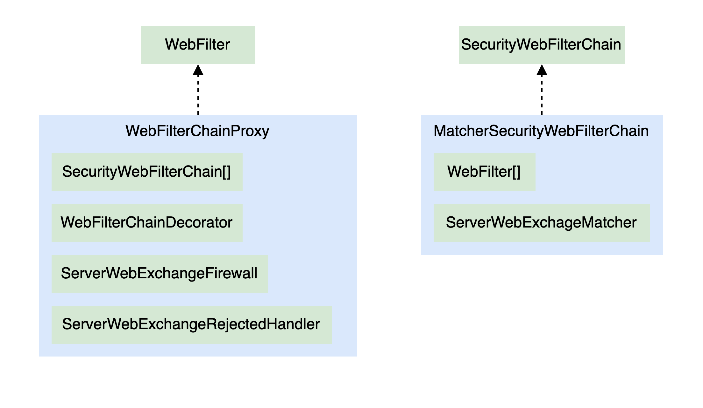
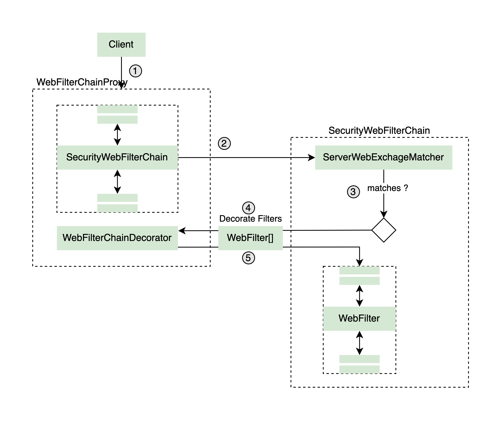
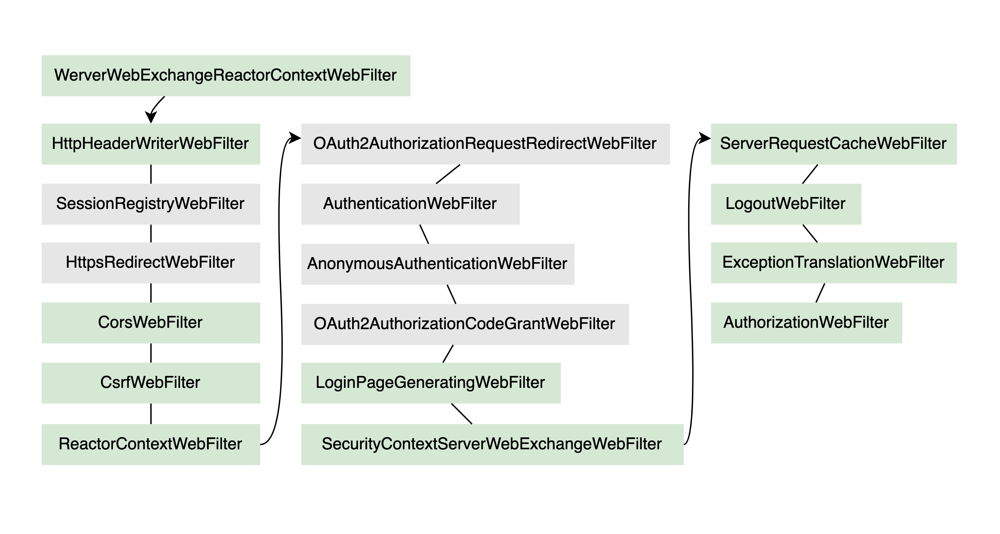
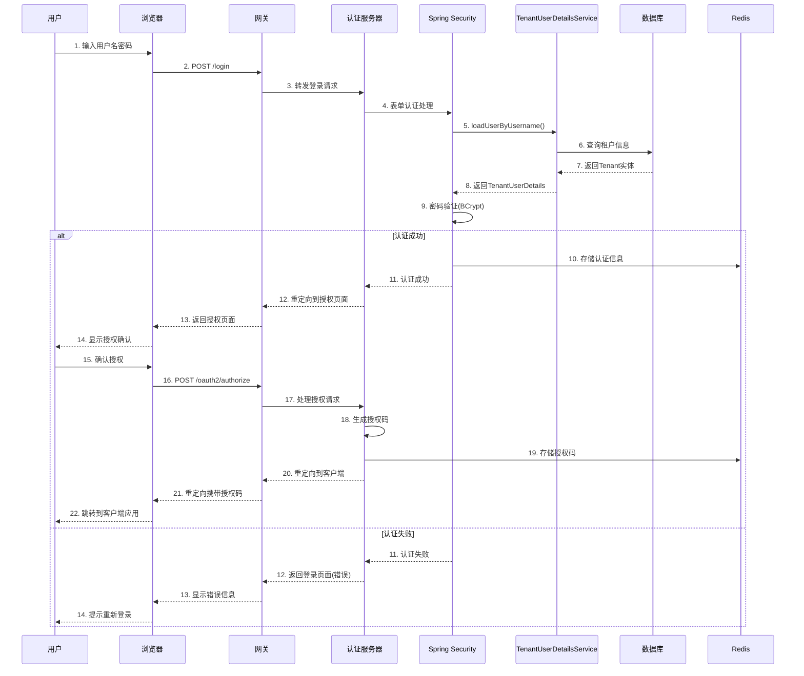
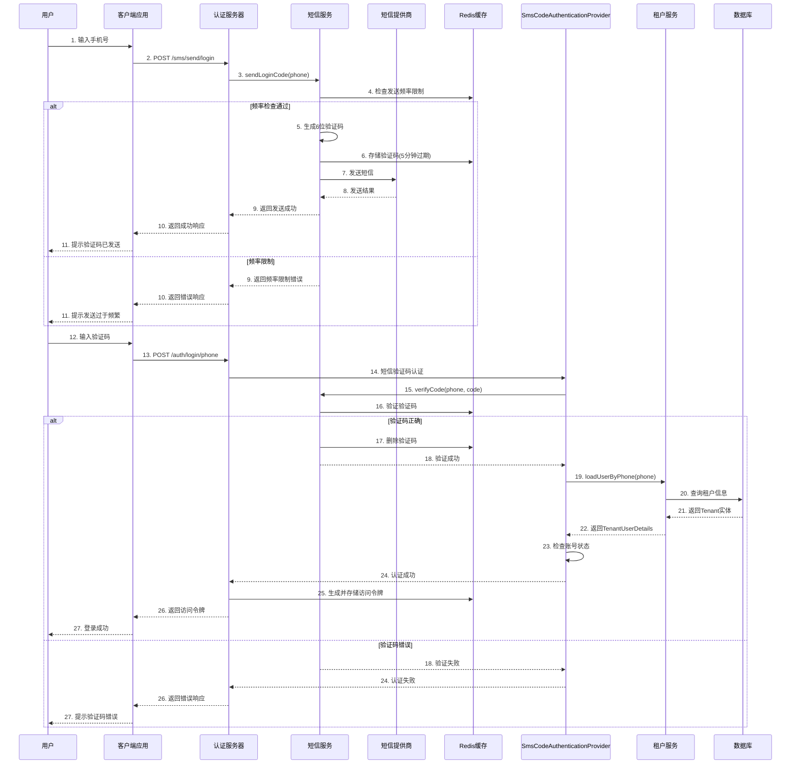
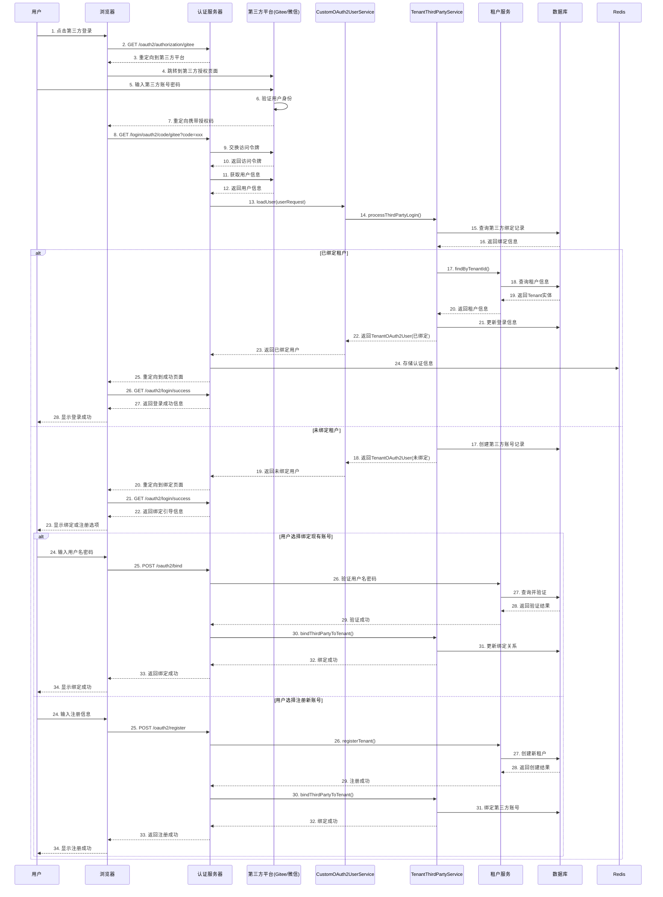
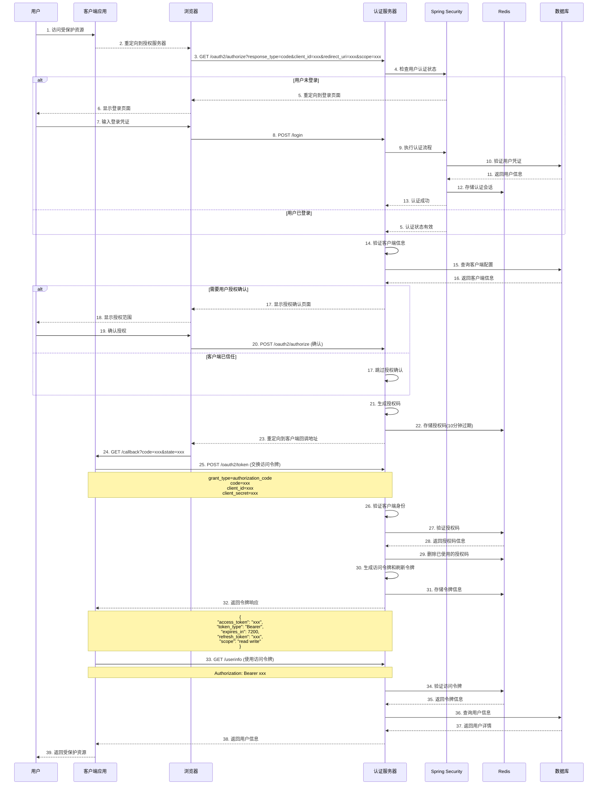
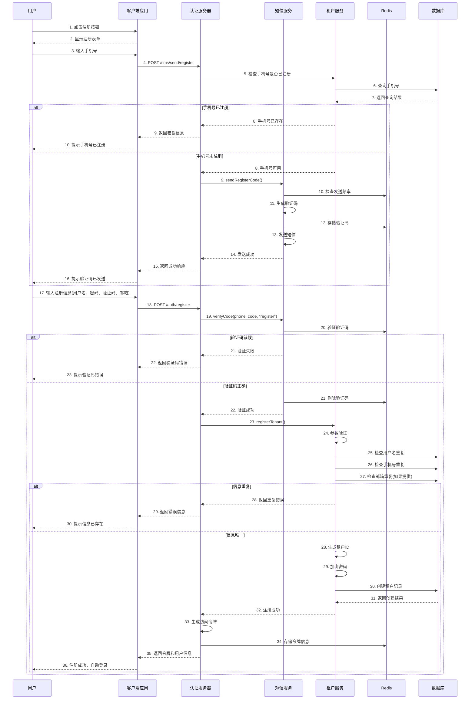

# 系统部署手册

## 一、项目规范

### 1、项目命名规则

（1）脚手架项目：framework-【功能简写】，例如</br>
（2）基础服务：【系统】-system，例如</br>luc-system
（3）认证服务：authorization-【功能】，例如</br>authorization-server
（4）核心业务服务：【业务】-center，例如</br>product-center
（5）小程序服务：mini-app-【小程序名称】，例如</br>mini-app-cookbook

### 2、数据库规范

（1）表规范

| column      | type        | default           | comment                     |
|-------------|-------------|-------------------|-----------------------------|
| id          | bigint      | auto increment    | 自增主键                        |
| dt_created  | timestamp   | current_timestamp | 创建时间                        |
| created_by  | varchar(64) | not null          | 创建人id                       |
| dt_modified | timestamp   | current_timestamp | 修改时间                        |
| modified_by | varchar(64) | not null          | 修改人id                       |
| deleted     | tinyint(1)  | 0                 | 是否被删除, 0否, 1是               |
| status      | tinyint(1)  | 0                 | 是否有效, 0否, 1是(根据业务考虑是否使用该字段) |


## 二、快速启动

## 三、认证与鉴权

Spring Cloud Gateway + Spring Security + OAuth2.0
核心接口：
WebFilter: 所有请求经过WebFilter处理，SpringSecurity使用了代理模式，通过WebFilterChainProxy代理SecurityWebFilterChain
SecurityWebFilterChain：由SpringSecurity提供的安全

请求链路：
1：请求进入WebFilterChainProxy，该代理类封装了已创建的SecurityWebFilterChain列表，对请求进行拦截、装饰
2：顺序遍历SecurityWebFilterChain列表，匹配请求路径，找到对应的SecurityWebFilterChain
3：执行SecurityWebFilterChain中的WebFilter列表，对请求进行拦截、装饰




Spring Security 默认的WebFilter实现及执行顺序


### 用户名密码登陆



手机号验证码登陆



第三方账号登陆



oauth2 code登陆



注册流程



## 四、账号体系

## 五、luc-framework脚手架核心功能

### 5.1 framework-apidoc

日志依赖，向外暴露/v3/api-doc接口，提供日志信息，支持配置鉴权接口（指向认证服务器）

（1）服务日志配置方式：

```yaml
springdoc:
  info:
    title: "XXX服务 API文档"
    version: "版本号"
    description: "服务描述"
    authorization-url: "获取授权的接口（至支持授权码）"
    token-url: "获取access token和refresh token"
    contract:
      name: "联系人姓名"
      url: "联系人主页"
      email: "联系人邮箱"
    license:
      name: "许可证名称(MIT、Apache等)"
      url: "许可证地址"
```

（2）网关聚合服务API文档方式：

```xml
<!--添加依赖-->
<dependencies>
    <dependency>
        <groupId>org.springdoc</groupId>
        <artifactId>springdoc-openapi-starter-webflux-ui</artifactId>
    </dependency>
</dependencies>
```

```yaml
# 增加配置
springdoc:
  swagger-ui:
    use-root-path: true
    oauth:
      client-id: "已注册的客户端id"
      client-secret: "密钥"
      scopes: "权限范围"
```

通过 [RefreshRouteEventListener.java](../../authorization-gateway/src/main/java/com/lc/authorization/gateway/config/RefreshRouteEventListener.java)
监听服务变化，聚合各服务API文档，访问<http://网关服务地址/swagger-ui/index.html>

## 六、其他配置

### 1、Maven

- [ ] 完善说明</br>

完整配置文件见[settings.xml](../mvn/settings.xml)</br>
说明：Maven版本3.6.3，中央仓库[阿里云云效仓库](https://packages.aliyun.com/)</br>
建议将仓库进行规划，目前分为RELEASE、SNAPSHOT</br>

（1）下载 maven 3.6.3, 解压到安装目录 ***/path/to/maven_home*** </br>
（2）设置环境变量 ***MAVEN_HOME=/path/to/maven_home***</br>
（3）修改 ***$MAVEN_HOME/settings.xml***</br>
· 本地仓库 ***localRepository*** 标签</br>
· 镜像 ***mirrors*** 标签</br>
· 服务器 ***servers*** 标签</br>
· 配置文件 ***profiles*** 标签</br>
jdk、仓库、sonar

（4）在项目的pom.xml中设置部署地址与Maven配置文件中一致

### 2、Sonar

#### · SonarCloud

#### · SonarServer

#### · SonarQube For IDE

### 3、Mysql

### 4、Nacos Cluster

### 3、Redis Cluster

### 4、Kafka based on Kraft Cluster

### 3、Docker

### 4、Kubernetes

```css
.circle-number::before {
  content: "•"; /* 或者使用其他字符 */
  color: black; /* 颜色 */
  font-size: 20px; /* 大小 */
  margin-right: 5px; /* 与文本的距离 */
}
```
